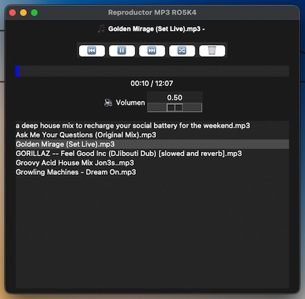

# 🎵 Reproductor de Audio Python

Reproductor de música con interfaz gráfica desarrollado en Python.


## 📸 Vista previa



## 📋 Descripción

Aplicación de escritorio que permite reproducir archivos de audio MP3 con una interfaz gráfica intuitiva y moderna. Desarrollado como proyecto académico en la carrera de Ingeniería en Software y Redes.

### ✨ Características principales

- 🎶 **Lista de canciones interactiva** con scroll
- ⏯️ **Controles completos** de reproducción (play, pause, stop, siguiente, anterior)
- 📊 **Barra de progreso animada** que muestra el avance de la canción
- 🏷️ **Visualización de metadatos** (título, artista, álbum, duración)
- 🎨 **Interfaz gráfica moderna** y fácil de usar
- 📂 **Soporte para múltiples formatos** de audio
- 💾 **Memoria de playlist** - recuerda tus últimas canciones
- 🔊 **Control de volumen** integrado
- 🔄 **Reproducción continua** automática

## 🛠️ Tecnologías utilizadas

- **Python 3.x** - Lenguaje de programación principal
- **Tkinter** - Librería para la interfaz gráfica (GUI)
- **Pygame** - Motor de reproducción de audio
- **Mutagen** - Extracción de metadatos de archivos MP3
- **Pillow (PIL)** - Procesamiento de imágenes para el ícono

## 📦 Instalación

### Requisitos previos

Asegúrate de tener Python 3.7 o superior instalado:
```bash
